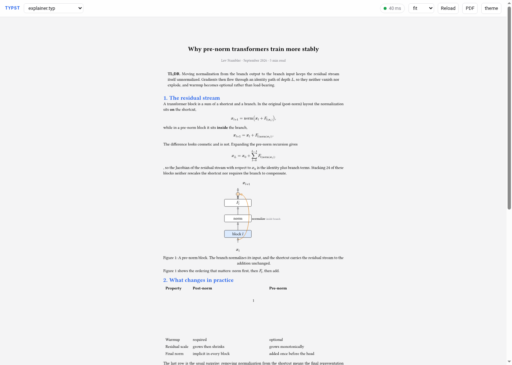
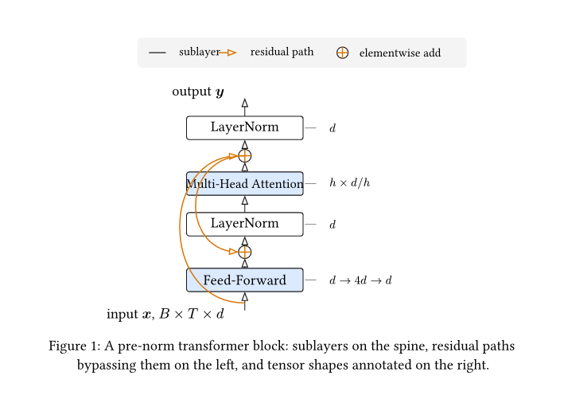

# pi-typst

Typst for the [pi coding agent](https://pi.dev): CLI tools, a live browser
preview, and skills that turn a concept into a typeset explainer with
[CeTZ](https://typst.app/universe/package/cetz/) diagrams.

- **`typst_compile`** — compile `.typ` to PDF/PNG/SVG through the typst CLI,
  with parsed diagnostics and an inline page image in the tool result.
- **`typst_cli`** — run the rest of the CLI (`eval`, `query`, `fonts`, `init`).
- **`typst_preview`** — serve the document over HTTP; the page compiles Typst
  *in the browser* with [typst.ts](https://github.com/Myriad-Dreamin/typst.ts)
  and re-renders as files change. The server only serves files.
- **`/typst-preview`** — the same thing as a slash command, opening the browser.
- **`/explain` and `/illustrate`** — prompt templates that force the
  render-inspect-fix loop.
- **Skills** — `typst-explain-illustrate`, `cetz-diagrams`, `typst-documents`.



`typst_preview` serves the document; the browser compiles it with typst.ts and
re-renders as files change.

## Install

```bash
pi install git:github.com/Lev-Stambler/pi-typst
```

For development, point pi at the checkout:

```bash
npm install                                  # typst.ts runtime + dev types
pi install "$(pwd)"                          # local path install
# or a one-off run:
pi -e ./extensions/index.ts
```

Requirements:

- **Typst CLI 0.13+** (`typst_compile` / `typst_cli`). Resolution order:
  `TYPST_BIN`, `PATH`, `~/.cargo/bin`, `~/.local/bin`, `/usr/local/bin`,
  `/opt/homebrew/bin`, `/usr/bin`. The preview server works without it.
- **Node 22.18+** (the extension is TypeScript loaded natively by pi; the
  selftest runs `.ts` directly through Node type stripping).
- Network on first use: CeTZ comes from the Typst package registry, typst.ts
  fonts are fetched once and cached under `~/.cache/pi-typst/fonts`.

## The preview server

`typst_preview` (or `/typst-preview`) starts a small HTTP server and returns a
URL such as `http://127.0.0.1:7777`.

- The browser downloads the workspace files (`/api/tree`, `/api/file`), mirrors
  them into a typst.ts virtual file system, compiles with Typst **0.15.1**, and
  renders SVG. Nothing is compiled on the server.
- The page re-checks file mtimes about once per second and re-renders on change,
  so saving a file is enough — no reload.
- The **PDF** button produces a PDF in the browser with `$typst.pdf()`.
- Typst packages (`@preview/cetz:0.5.2`, …) are fetched by the browser from
  `packages.typst.org`; fonts go through `/api/fonts/*` and are cached on disk,
  which keeps the viewer working offline after the first load.
- typst.ts is served from `node_modules` when installed. If it is missing (for
  example a bare local-path install without `npm install`), the server reports
  `assets.mode: "cdn"` and the viewer loads typst.ts from jsDelivr instead.
- typst.ts is pinned to `0.8.0-rc3` because it embeds Typst **0.15.1**, matching
  the Typst 0.15 line that the CLI tools and the skills target. It will move to
  `0.8.0` stable when that ships; the pin lives in `package.json` and in
  `TYPST_TS_VERSION` in `extensions/lib/server.ts`.

Arguments: `doc`, `workspace`, `port` (default 7777, falls back to the next free
port), `host` (default 127.0.0.1), `cjk` (auto-detected from the document).

## Tools

### `typst_compile`

| Parameter | Default | Meaning |
| --- | --- | --- |
| `input` | required | `.typ` document, relative to cwd or absolute |
| `format` | `pdf` | `pdf`, `png`, `svg`, `html` |
| `output` | derived | output path; `{p}` is added automatically for png/svg |
| `pages` | all | e.g. `1`, `2-4` |
| `ppi` | 144 | PNG resolution |
| `root` | — | Typst project root for absolute imports |
| `font_paths` | — | extra font directories |
| `inputs` | — | `sys.inputs` key/value pairs |
| `preview` | `first` | return page images: `none`, `first`, `all` |
| `preview_pages` | page 1 | pages to render for the inline preview |
| `preview_ppi` | 110 | preview resolution (capped at 200) |

The tool throws on compile errors with `file:line:column: error: message`
diagnostics, so the model sees exactly what Typst saw.

### `typst_cli`

`args` (allow-listed to `compile`, `eval`, `query`, `fonts`, `init`, `help`,
`--version`), plus optional `cwd` and `timeout_ms`.

## Skills

| Skill | Use when |
| --- | --- |
| `typst-explain-illustrate` | A concept must become an explainer with figures |
| `cetz-diagrams` | You need to draw something (2D or 3D) in Typst |
| `typst-documents` | Writing, laying out, or debugging a `.typ` document |

`cetz-diagrams` ships `references/cetz-api.md`, a condensed CeTZ 0.5.2 API with
verified signatures, recipes, and pitfalls. `typst-documents` routes to a
vendored copy of the MIT-licensed
[claude-skill-typst](https://github.com/lucifer1004/claude-skill-typst)
reference set (see `THIRD_PARTY_NOTICES.md`).

## Examples

`examples/` contains compiling, self-contained figures used by the skills and by
the selftest:

| File | Teaches |
| --- | --- |
| `transformer-block.typ` | Vertical spine, residual bypasses, shape annotations, legend |
| `attention-matrix.typ` | Cell loops, value-encoded fills, masked region, color legend |
| `pipeline-flow.typ` | Grouped stages, braces, phase divider, feedback arc |
| `tree-diagram.typ` | `tree.tree` with depth-styled nodes and callback edges |
| `three-d-vectors.typ` | `ortho` + `on-xz`/`on-xy`, 3D vector and projection |
| `explainer.typ` | A complete one-page explainer: TL;DR, math, figure, table, refs |



```bash
typst compile --root . examples/explainer.typ out.pdf
```

## Configuration

| Variable | Effect |
| --- | --- |
| `TYPST_BIN` | Explicit typst executable |
| `PI_TYPST_WORKSPACE` | Default directory mirrored into the browser compiler |
| `PI_TYPST_VENDOR_DIR` | Override the `node_modules` root used for typst.ts assets |
| `XDG_CACHE_HOME` | Base directory for the cached font assets (`pi-typst/fonts`) |
| `CHROME_PATH` | Browser used by `npm run selftest:browser` |

## Development

```bash
npm install
npm run typecheck
npm run selftest            # CLI + server + browser checks
npm run selftest:browser    # require the headless-Chrome render check
```

The selftest compiles the examples with the CLI, exercises every preview-server
route, and renders a CeTZ document through typst.ts in headless Chrome.

## Troubleshooting

- **"Could not find a usable `typst` binary"** — install Typst or set
  `TYPST_BIN`. The preview server still works without the CLI.
- **Browser preview shows a boot error** — run `npm install` in the package
  directory so the typst.ts assets exist, or check the browser console; the
  server falls back to the CDN when assets are missing but still needs network
  access on the first load.
- **CeTZ import fails in the browser** — the browser fetches
  `packages.typst.org` directly; a network that blocks it will break previews
  while `typst_compile` keeps working (it uses the local package cache).
- **CJK documents** — font assets for Chinese/Japanese/Korean are loaded
  automatically when the document contains CJK characters; force it with the
  `cjk` argument.

## Related work

- [pi-typst-skill](https://github.com/Auda29/typst_skill) — skills-only package
  that nudges pi toward `.typ` artifacts. Complementary; it has no tools or
  preview. Installing both is fine.
- [typst-cetz-skills](https://github.com/edoardob90/typst-cetz-skills) and
  [typst-cetz-skill](https://github.com/statzhero/typst-cetz-skill) — CeTZ agent
  skills targeting CeTZ 0.4.x. Linked from the notices; not copied (no license
  declared).
- [claude-skill-typst](https://github.com/lucifer1004/claude-skill-typst) — MIT
  Typst 0.15 reference set, partially vendored here.
- [typst.ts](https://github.com/Myriad-Dreamin/typst.ts) — Typst compiled to
  WebAssembly; the browser renderer.

## License

MIT. See [LICENSE](LICENSE) and [THIRD_PARTY_NOTICES.md](THIRD_PARTY_NOTICES.md).
